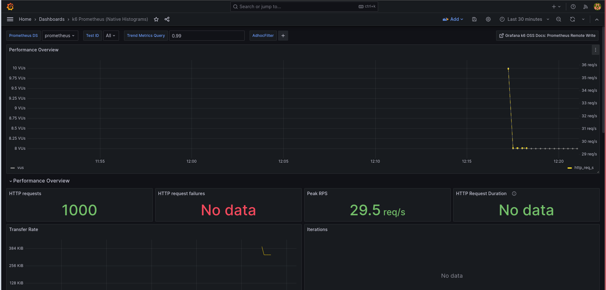
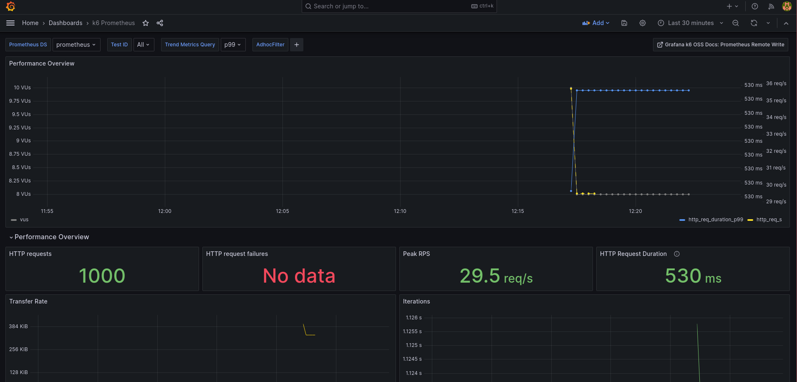
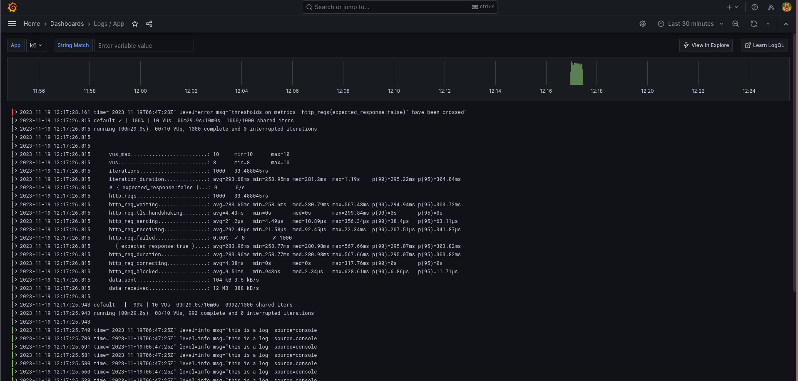

# k6 Load Testing with Prometheus, Grafana, and Loki Integration

This repository provides a setup for performance testing using k6, with monitoring and observability powered by Prometheus, Grafana, and Loki.

## Overview

The stack includes the following services:

- **k6:** The load testing tool.
- **Prometheus:** A monitoring and alerting toolkit.
- **Grafana:** A platform for monitoring and observability.
- **Loki:** A horizontally scalable, multi-tenant log aggregation system.
- **Promtail:** An agent for ingesting logs into Loki.

## Prerequisites

- Docker: [Install Docker](https://docs.docker.com/get-docker/)
- Docker Compose: [Install Docker Compose](https://docs.docker.com/compose/install/)

## Setup

- Clone this repository:

   ```bash
   git clone https://github.com/redsh4d0w/k6-prometheus-grafana-loki.git
   cd k6-prometheus-grafana-loki
   ```

- Edit the .env file and update the configurations

## Dashboards





